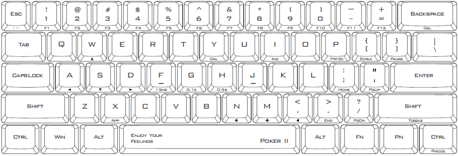

# karabiner poker II layout

Custom config file used by [karabiner](https://pqrs.org/osx/karabiner/) remapping keyboard layout to poker II layout. I use Logitech K270 keyboard, so poker II `Fn` is Windows `Context Menu` key. 

Done:

- Wasd navigation arrow
- F1 to F12 mapped to 1 - '=' keys
- Home, End, Page Up, and Page Down

Other than that is still unmapped.